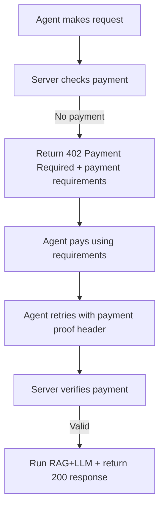

# Interactive Mind Chat - Agent API Specification (with x402)

This repository exposes a chat API used by the Quartz UI modal, but agents (Claude, other LLM tooling, or server-side orchestrators) may also call the API directly.

This document specifies:

- A **minimal** endpoint compatible with the existing UI: `POST /chat`
- An **OpenAI-style** endpoint convenient for agent frameworks: `POST /v1/chat/completions`
- The **shared RAG + LLM behavior** (Voyage embeddings + pgvector similarity search + Claude Haiku 4.5)
- How to add **pay-per-call monetization** via **x402** (HTTP `402 Payment Required` + retry with payment proof)

> **Working document for this repository.** Updated as the agent API evolves. The PoC backend currently implements the minimal `POST /chat` route in `supabase/functions/chat/index.ts`. The OpenAI-style route is specified here so it can be added as a thin wrapper later.

## 1. Base URL

The Quartz UI sets the chat API base URL at build time via `CHAT_API_BASE_URL`.

- Existing UI call: `POST {CHAT_API_BASE_URL}/chat`
- Agent endpoint call (this spec):
  - `POST {CHAT_API_BASE_URL}/chat`
  - `POST {CHAT_API_BASE_URL}/v1/chat/completions`

Notes:

- `CHAT_API_BASE_URL` should have **no trailing slash**.
- x402 integration is transport-level and does not require API keys; however CORS may matter for browser-based agents.

## 2. Shared Conversation + RAG Behavior

Both endpoints use the same pipeline:

1. **Input message** is embedded with Voyage (model `voyage-4-lite`, input_type `query`)
2. **pgvector similarity search** retrieves top-k chunks via RPC `match_vault_chunks(query_embedding, match_count)`
3. The server builds a **system prompt**:
   - A fixed identity prompt ("Interactive Mind of The Open Machine ...")
   - Optionally appended with a context block made from the retrieved chunk texts
4. The server calls Claude via the Anthropic **Messages API**:
   - Model: `claude-haiku-4-5`
   - `max_tokens`: current implementation uses `1024` for replies
5. The server returns the assistant reply text.

### 2.1 RAG context rules

- If Voyage and Supabase are configured, context retrieval is attempted.
- If retrieval finds no chunks, the server answers using only the base identity prompt.
- Retrieval parameters (current defaults):
  - embedding model: `voyage-4-lite`
  - embedding dimension: `1024`
  - RPC match count: `5` (constant `RAG_MATCH_COUNT` in the current Edge Function)

### 2.2 Conversation history rules

- The minimal `/chat` endpoint accepts an Anthropic-like history array:
  - `history[]` contains entries shaped as `{ role: "user" | "assistant", content: string }`
- The server passes this history into the Anthropic request.
- The most recent user message is appended as the final `user` message.

### 2.3 Content scope

Iteration 1 (PoC) scope:

- Knowledge base: **om-outer-mind** (public research archive stored in `content/`)
- No write access and no direct editing/creation of vault content
- No auth required for the PoC UI
- Multi-vault and role-based filtering are out of scope for this iteration

## 3. Endpoint: Minimal Contract (UI-compatible)

### 3.1 `POST /chat`

Request JSON:

```json
{
  "message": "string (required, non-empty)",
  "history": [
    { "role": "user", "content": "string" },
    { "role": "assistant", "content": "string" }
  ]
}
```

Response success:

```json
{ "reply": "string" }
```

Response error (application-level):

```json
{ "error": "string" }
```

Common HTTP codes:

- `400` for invalid JSON or missing/empty `message`
- `405` for non-`POST` methods
- `402` when x402 monetization is enabled and payment has not been satisfied (see Section 6)
- `502` for upstream LLM failures (when the server knows the request made it to the LLM but the model response failed)
- `500` for server misconfiguration (e.g., missing `ANTHROPIC_API_KEY`) or internal errors

Reference (current implementation):

- Handler: `supabase/functions/chat/index.ts`
- UI request/response mapping: `chat/src/ChatModal.tsx`

## 4. Endpoint: OpenAI-Style Completions (Agent-friendly)

This endpoint is specified so agent frameworks that expect an OpenAI-like schema can call this API directly.

### 4.1 `POST /v1/chat/completions`

Request JSON:

```json
{
  "model": "optional-string",
  "messages": [
    { "role": "user", "content": "string" },
    { "role": "assistant", "content": "string" }
  ],
  "max_tokens": "optional-number"
}
```

Supported `messages[].role`:

- `user`
- `assistant`

Notes:

- The PoC backend does not currently accept system messages from the client. If you add support later, keep the mapping rules explicit.
- If `max_tokens` is provided, the server SHOULD clamp it to the provider’s configured maximum (current code uses `1024`).

Response JSON (OpenAI-compatible shape):

```json
{
  "id": "string",
  "object": "chat.completion",
  "created": 0,
  "model": "claude-haiku-4-5",
  "choices": [
    {
      "index": 0,
      "message": { "role": "assistant", "content": "string" },
      "finish_reason": "stop"
    }
  ]
}
```

Usage:

- This spec does not require returning `usage` (token accounting), because the current Edge Function does not collect token usage from Anthropic.

## 5. Error Model (API-level)

This spec only standardizes the *minimal* application error shape used by the current handler:

```json
{ "error": "string" }
```

If you add more structure later, keep it compatible with the UI’s expectations in `chat/src/ChatModal.tsx` (it currently treats `error` as a string).

## 6. Monetization: x402 Pay-Per-Call

This section defines how to monetize either endpoint using x402.

### 6.1 Overview

With x402 enabled:

- If the agent makes a request without payment proof, the server responds with:
  - HTTP `402 Payment Required`
  - A JSON response body that includes payment requirements (machine-readable)
- The agent pays and retries the same request, attaching payment proof in an HTTP header
- On verification, the server returns the normal 2xx response for the endpoint

### 6.2 x402 flow (end-to-end)



### 6.3 x402 response (server -> agent)

When payment is missing or invalid, the server MUST return:

- HTTP status: `402`
- Body MUST include x402 `accepts` + `paymentRequirements` (exact schema depends on your x402 version/facilitator).

Example body shape:

```json
{
  "accepts": [
    {
      "paymentRequirements": {
        "scheme": "exact",
        "network": "base-sepolia",
        "asset": "USDC or token-identifier",
        "amount": "0.001",
        "destination": "0xReceiverAddress"
      }
    }
  ]
}
```

### 6.4 x402 payment proof header (agent -> server)

x402 has multiple header variants depending on version/library.

This API spec supports the two common variants:

1. Header names used in the “learn” style examples:
   - `X-PAYMENT`: base64-encoded JSON payment payload
   - `X-PAYMENT-RESPONSE`: present in the successful response (optional for the client’s retry logic)
2. Header names used in x402 “v2” discussions:
   - `PAYMENT-SIGNATURE`: base64-encoded signed payment payload
   - `PAYMENT-RESPONSE`: present in the successful response

Implementation guidance:

- Your server SHOULD accept whichever of these headers your deployed x402 client library produces.
- Your server SHOULD emit the matching settlement header (`X-PAYMENT-RESPONSE` or `PAYMENT-RESPONSE`) after successful verification.

### 6.5 Flat pricing policy (what “amount” means)

This spec models revenue as a **flat per-call charge**.

Define (server-side) these environment-configured values:

- `X402_PRICE_AMOUNT`: decimal string (e.g. `"0.001"`)
- `X402_PRICE_CURRENCY`: currency/token label used by your x402 scheme (e.g. `"USDC"`)
- `X402_CHAIN`: network identifier for the payment scheme (e.g. `"eip155:8453"` for Base mainnet)
- `X402_RECEIVER_ADDRESS`: address receiving funds
- `X402_ENABLED`: boolean to turn monetization on/off

The x402 middleware (or facilitator layer) should map those into the `paymentRequirements` returned in the `402` response.

### 6.6 Example: Minimal endpoint with x402 retry

Initial request (no proof):

```bash
curl -i "{CHAT_API_BASE_URL}/chat" \
  -H "Content-Type: application/json" \
  -d '{
    "message": "What is The Open Machine?",
    "history": []
  }'
```

Expected: `402 Payment Required` with payment requirements in the response body.

Retry with proof:

```bash
curl -i "{CHAT_API_BASE_URL}/chat" \
  -H "Content-Type: application/json" \
  -H "X-PAYMENT: <base64-payload-from-x402-client>" \
  -d '{
    "message": "What is The Open Machine?",
    "history": []
  }'
```

Expected success:

```json
{ "reply": "..." }
```

### 6.7 Example: OpenAI-style endpoint with x402 retry

Initial:

```bash
curl -i "{CHAT_API_BASE_URL}/v1/chat/completions" \
  -H "Content-Type: application/json" \
  -d '{
    "messages": [
      { "role": "user", "content": "Summarize the purpose of OM." }
    ]
  }'
```

Retry:

```bash
curl -i "{CHAT_API_BASE_URL}/v1/chat/completions" \
  -H "Content-Type: application/json" \
  -H "X-PAYMENT: <base64-payload-from-x402-client>" \
  -d '{
    "messages": [
      { "role": "user", "content": "Summarize the purpose of OM." }
    ]
  }'
```

### 6.8 Billing/revenue notes

Because this is per-call billing, the server/provider can:

- monetize each call to generate the RAG retrieval + LLM completion cost
- reject unpaid calls quickly with HTTP `402`, before spending embedding/LLM compute (best practice)

### 6.9 Chosen facilitator (reference implementation) and account overhead (working note)

x402’s protocol flow is facilitator-agnostic, but **your implementation needs something that can verify and settle payments**.

This repo’s spec uses a **reference facilitator** pattern: you may run a facilitator you deploy, or use a facilitator provided by a third party. This section documents a concrete option you can use as a starting point.

#### Reference facilitator: `raid-guild/x402-facilitator-go`

- Repo: [raid-guild/x402-facilitator-go](https://github.com/raid-guild/x402-facilitator-go)
- Deployment: designed for “one-click deploy” on serverless platforms like Vercel
- Facilitator responsibilities (at a high level): verify `X-PAYMENT`/payment payloads and then settle on-chain via a `/settle` call
- Facilitator endpoints (as described by the project): `POST /verify` and `POST /settle` (and discovery endpoints like `/supported`)

#### What “new account overhead” you should expect

In practice, there are usually **two** categories of accounts involved:

1. **Facilitator operator account (you / your infrastructure)**
   - You run the facilitator and provide its signing/private key via environment variables (the reference facilitator uses `PRIVATE_KEY`).
   - That facilitator account must have enough assets to pay for **gas/transaction execution**.
   - You also provide network connectivity via RPC URLs (for example Base / Base Sepolia / Ethereum mainnet / testnets).
   - Optionally, you can protect `POST /verify` and `POST /settle` with auth settings (the reference facilitator supports API-key based auth patterns; if you do not configure auth, endpoints are public).

2. **Agent wallet account (the caller / Claude integration)**
   - Agents still need a way to sign payment payloads locally (typically via an x402 client/SDK or an agent wallet library).
   - This does **not** require you to create “user accounts” for your API; it requires the agent runtime to have a wallet private key (or an SDK that can sign on the agent’s behalf).

What you generally do **not** need:

- You do not need to create a “new account” just for the HTTP API itself (your API just validates payment headers/proofs as x402 requires).
- You do not need subscriptions/credit-card style onboarding for agents, because x402 is pay-per-call.

### 6.10 x402 integration options (avoid or use Coinbase libraries)

This spec is intentionally written so you can choose how much x402 client logic you import on the **server/API side** and/or the **agent side**.

At a high level, the contract your agent needs is consistent:

1. The agent makes an HTTP request to your endpoint.
2. If payment is missing, the server returns `402 Payment Required` with machine-readable payment requirements.
3. The agent produces payment proof using whatever x402 client mechanism it supports.
4. The agent retries the exact same request, attaching payment proof in an HTTP header.
5. Your server verifies the payment (typically via the facilitator) and returns the normal response.

#### Option A: Minimal server implementation (no Coinbase x402 package)

If your goal is to avoid adding the Coinbase x402 middleware/client dependencies to your server, you can:

- Treat the facilitator as the authority for verification and settlement
- Return `402` with payment requirements in whatever structure your chosen x402 client expects
- On retry, forward/verify the received proof by calling your facilitator’s `verify`/`settle` endpoints

In this option, the server remains an “x402 policy gate” around the existing RAG+LLM pipeline, and the facilitator handles the protocol details.

This is compatible with the facilitator reference implementation described in §6.9.

#### Option B: Use Coinbase tooling on the agent side (while keeping server dependencies minimal)

If the agent runtime can use an x402 client/SDK (including Coinbase’s), then:

- The agent handles `402` negotiation automatically
- The agent sends the proof header that its x402 client library generates (for example `X-PAYMENT`)
- Your server only needs to accept those proof headers and return `200` after verification

This option can work well for teams building agent infrastructure in TypeScript/Python/Go, without requiring you to replicate x402 verification cryptography inside your API.

#### Option C: Add a payment-adapter “wrapper” for Claude (recommended if Claude-tooling can’t handle 402)

Some agent environments (including some Claude tool integrations) may not automatically implement the `402 -> pay -> retry` loop.

If the calling agent cannot reliably implement the x402 retry logic, deploy a small adapter endpoint/tool that:

- Accepts the same input as your agent-facing API
- Performs the x402 negotiation + retry on behalf of the agent
- Returns only the final `200` response body to the agent

This preserves a simple developer experience: “Claude calls one API; the adapter handles x402.”

### 6.11 Agent integration guidance (Claude and “any agent”)

For a third party building an agent that can call your API, the only requirement is that the agent can execute the x402 lifecycle over HTTP.

#### What “Claude calls the API” means in practice

Claude itself is a model, not a payment client. For Claude-driven systems, one of these must be true:

- Their orchestrator/tool runner implements x402 retry logic (on `402`, sign payment proof, retry the request)
- Or they front your API with a wrapper adapter that implements x402 on their behalf (§6.10 Option C)

#### Minimal generic agent algorithm

1. `POST /chat` (or `POST /v1/chat/completions`) without payment proof.
2. Receive `402` with payment requirements in the response body.
3. Construct a payment payload and generate proof using an x402-capable client mechanism.
4. Retry the same request, adding the proof header (`X-PAYMENT` in many “exact scheme” examples; accept whichever header variant your facilitator/client produces).
5. Read the `200` response body (`{ reply }` or OpenAI-style completion JSON).

## 7. Implementation Mapping (Non-normative)

This section documents where the current behavior exists so the eventual backend implementation can remain consistent.

- Minimal endpoint behavior:
  - Request mapping: `chat/src/ChatModal.tsx`
  - Supabase Edge Function handler: `supabase/functions/chat/index.ts`
- RAG + LLM pipeline:
  - Voyage embed: `embedQuery()` in `supabase/functions/chat/index.ts`
  - pgvector retrieval: RPC `match_vault_chunks` in `supabase/functions/chat/index.ts`
  - Anthropic completion: `fetch("https://api.anthropic.com/v1/messages", ...)` in `supabase/functions/chat/index.ts`

Proposed OpenAI-style wrapper behavior:

- Extract the final `messages[]` entry as the user message
- Convert preceding `messages[]` entries into the minimal `history` format
- Invoke the same pipeline as `/chat`

## Appendix A: Mermaid-Friendly Header Summary

If you deploy x402 integration, consider documenting the exact header names your deployed x402 client uses:

- Proof header: `X-PAYMENT` (base64) or `PAYMENT-SIGNATURE` (base64)
- Settlement header on success: `X-PAYMENT-RESPONSE` or `PAYMENT-RESPONSE`

